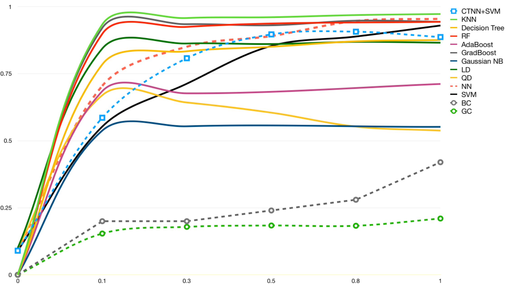

## Group Project for CMU 18-847 2019 Spring

### Convolutional Spiking Neural Network and Temperal Neural Network

### Citation 

The architecture of this project uses the CSNN proposed in [STDP-based spiking deep convolutional neural networks for object recognition](https://arxiv.org/abs/1611.01421)

The coding library uses the [Spyketorch](https://arxiv.org/abs/1903.02440). The Github Page of SpykeTorch can be found [here](https://github.com/miladmozafari/SpykeTorch)

### Overview 

This porject implements the Convolutional Spiking Neural Network (CSNN) with SpykeTorch. We test the performance of CSNN on the MNIST dataset, and compare the results with Temporal Neural Network (TNN). We implement the Band Corelator and General Corelator in the TNN modules to show that CSNN has a better performance compared to TNN. However, we did not achieve as high accuracy as mentioned in the paper, STDP-based spiking deep convolutional neural networks for object recognition. And we also find that traditional machine learning methods may provide better accuracy on MNIST compared to CSNN. Another improvement we made is that we use more classifiers rather than only using SVM. We found that a neural network with only one hidden layer will perform better than using SVM as the final classifier. 

### Dependency

* Python 3.6
* Numpy
* Pytorch 
* SpykeTorch

### Training and Testing 

`python project/CTNN.py` 

